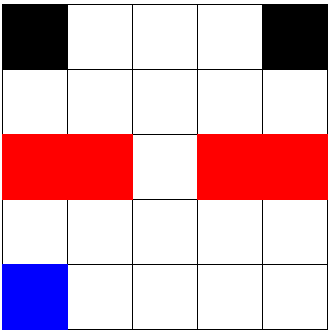

# Reinforcement Learning: Application in Grid World and Random Walk Scenarios

This repository contains implementations of reinforcement learning algorithms applied to two specific problems: navigating a grid world and performing a random walk on a 7x7 grid. The project includes code, results, and analysis to evaluate the performance of these techniques.

## Objective

### Grid World Problem

The agent starts at the blue square and moves to a neighboring state with equal probability. If the agent moves to a red state, it receives a reward of -20 and goes back to the start, i.e., the blue square. A move between any two other states receives a reward of -1. A move that attempts to move outside of the grid receives a reward of -1. The black squares serve as terminal states. The goal is to pass through the opening in the red “wall” and reach one of the black squares to terminate the episode.



### Random Walk on a 7x7 Grid

The agent starts at the center of the grid and is equally likely to move up, down, left, or right. The lower left and upper right corners are terminal states with rewards -1 and 1, respectively. All other transitions receive a reward of 0. Attempts to move outside the grid result in the agent staying in place with a reward of 0.

## Implemented Algorithms

1. **Grid World**:
   - **SARSA**: On-policy TD control algorithm to estimate the Q-values and plot the resulting trajectory.
   - **Q-Learning**: Off-policy TD control algorithm to estimate the Q-values and plot the resulting trajectory.

2. **Random Walk**:
   - **Gradient Monte Carlo Method**: Computes the value function for the random walk policy.
   - **Semi-Gradient TD(0) Method**: Uses an affine function approximation to compute the value function.

## Project Structure

- `README.md`: This file.
- `R_L_A3.ipynb`: Jupyter notebook containing the implementation of the assignment.
- `Reinforcement Learning Assignment 3.pdf`: The original assignment description.
- `Gridworld.png`: The grid world image included in the assignment description.

## How to Run

1. **Clone the Repository**:
   ```bash
   git clone https://github.com/mrw-soumik/Reinforcement-Learning-An-Applied-Evaluation-through-Grid-World-and-Random-Walk-Scenarios.git
   cd Reinforcement-Learning-An-Applied-Evaluation-through-Grid-World-and-Random-Walk-Scenarios
   ```

2. **Open the Colab Notebook**:
   You can run the code directly in Google Colab by following [this link](https://colab.research.google.com/drive/1NW05u7otnbaNKk0g3d51fJ99NvK_9m1s?usp=sharing).

3. **Install Dependencies**:
   Ensure you have Python 3 installed. Install the required libraries:
   ```bash
   pip install numpy matplotlib
   ```

4. **Run the Notebook**:
   Open `R_L_A3.ipynb` in Jupyter Notebook or Jupyter Lab and run the cells to execute the code and generate the results.

## Results

### Grid World

1. **SARSA Algorithm**:
   - **Trajectory Plot**: The trajectory of the agent using the SARSA algorithm is plotted, showing how the agent navigates through the grid while avoiding penalty states (red squares) and reaching terminal states (black squares). Initially, the agent explores various paths, but over time it learns to avoid the red squares and find a safer path to the terminal states.
   - **Reward Trend**: The reward trend for the SARSA algorithm demonstrates the total rewards accumulated over multiple episodes. Initially, the rewards show high variability as the agent explores the grid. Over time, the rewards stabilize, indicating successful learning of the optimal policy.

2. **Q-Learning Algorithm**:
   - **Trajectory Plot**: The trajectory plot for the Q-Learning algorithm shows a more direct path to the terminal states compared to SARSA. The Q-Learning agent learns faster due to its off-policy nature, allowing it to find the optimal path more efficiently.
   - **Reward Trend**: The reward trend for the Q-Learning algorithm shows faster convergence to higher rewards. The agent quickly learns the optimal path, with occasional drops in rewards indicating exploration of suboptimal paths or penalty states.

### Random Walk

1. **Gradient Monte Carlo Method**:
   - **Value Function Estimation**: The value function for the random walk policy is estimated using the Gradient Monte Carlo method. The results show a clear gradient from the negative terminal state to the positive terminal state, capturing the expected value of being in each state. The estimation is relatively smooth, indicating effective averaging over multiple simulations.
   - **Comparison with Exact Value Function**: The estimated value function is compared with the exact value function, revealing minor discrepancies in certain states, especially those further from the terminal states.

2. **Semi-Gradient TD(0) Method**:
   - **Value Function Estimation**: The value function is also estimated using the Semi-Gradient TD(0) method with an affine function approximation. The results show more variability and less smooth transitions compared to the Monte Carlo method, reflecting the localized learning updates and sensitivity to initial conditions.
   - **Comparison with Exact Value Function**: The comparison shows that the TD(0) method has some bias, particularly near the negative terminal state, where it underestimates the high negative impact compared to the exact method and the Monte Carlo method.

### Analysis and Insights

- **Learning Efficiency**: The Q-Learning algorithm converges faster to the optimal policy in the Grid World problem due to its off-policy nature. SARSA, while slower, results in safer learning paths.
- **Risk and Safety**: SARSA's on-policy approach results in more conservative learning, reducing the risk of encountering penalty states. Q-Learning, being off-policy, sometimes takes riskier paths but learns the optimal policy more quickly.
- **Value Function Accuracy**: The Gradient Monte Carlo method provides smoother and more stable value function estimations for the Random Walk problem, while the Semi-Gradient TD(0) method, although faster, may introduce bias and variability in the estimations.

## Contributing

Contributions are welcome! Please fork the repository and submit a pull request for any improvements or additional features.
